## Overview

This began with an email from Susan VanderPlas, Apr 24, 2025:

*Di, one of my students found this — it appears to be a total rip-off of Patrick's paper. It's bad, lol. But still, it shouldn't be allowed to stand.* 

Susan included a copy of the published paper so I could see what she was seeing. To which, I responded:

*Oh shit! This needs reporting. I’m not sure how to do it but it is pure academic theft!*

and she followed with:

*That was my reaction, too — I haven't ever had to do this but wtf, it's academic theft and it's bad theft — just an ugly and sad approximation to Patrick's paper.*

This is what we were looking at:

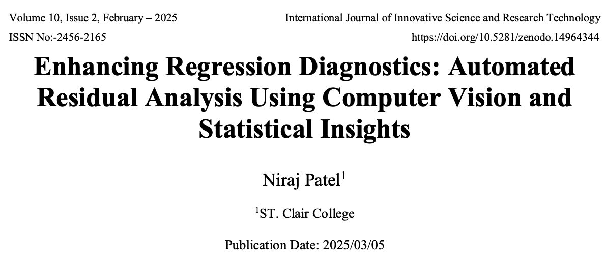{style="box-shadow:0 8px 20px rgba(0,0,0,.25); border-radius:8px;"}

which is awfully similar to the paper Weihao (Patrick) Li has placed on the arXiv on Nov 1, 2024.

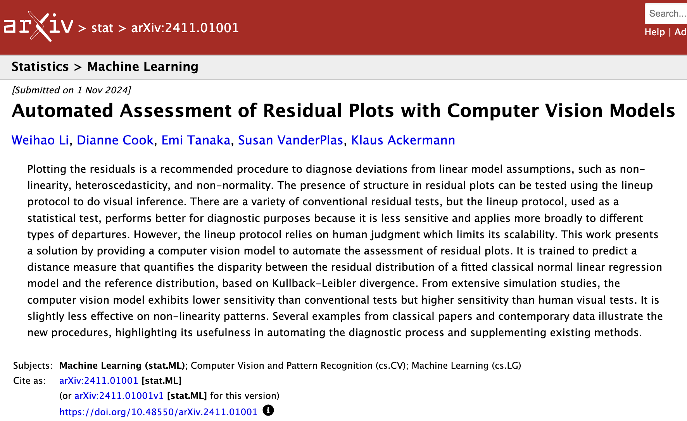{style="box-shadow:0 8px 20px rgba(0,0,0,.25); border-radius:8px;"}

And a look inside the article revealed more: equations and figures that were poor image copies from the original article:

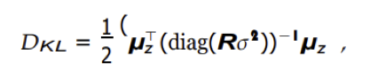{width=300 fig-align="center" style="box-shadow:0 8px 20px rgba(0,0,0,.25); border-radius:8px;"}

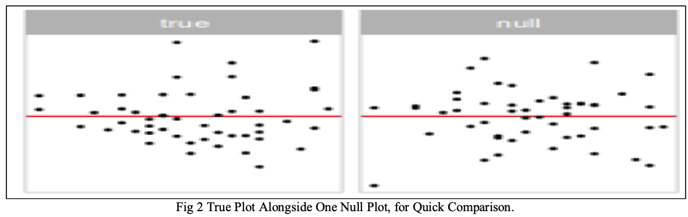{style="box-shadow:0 8px 20px rgba(0,0,0,.25); border-radius:8px;"}

and amazingly, the acknowledgements section pointing to Patrick's GitHub repository for the paper:

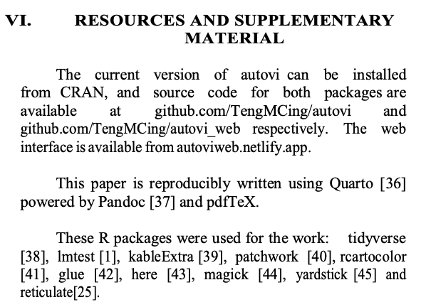{width=500 fig-align="center" style="box-shadow:0 8px 20px rgba(0,0,0,.25); border-radius:8px;"}

## Communication with Journal Editor

On Apr 25, 2025, I sent ths email to the editor of the journal:

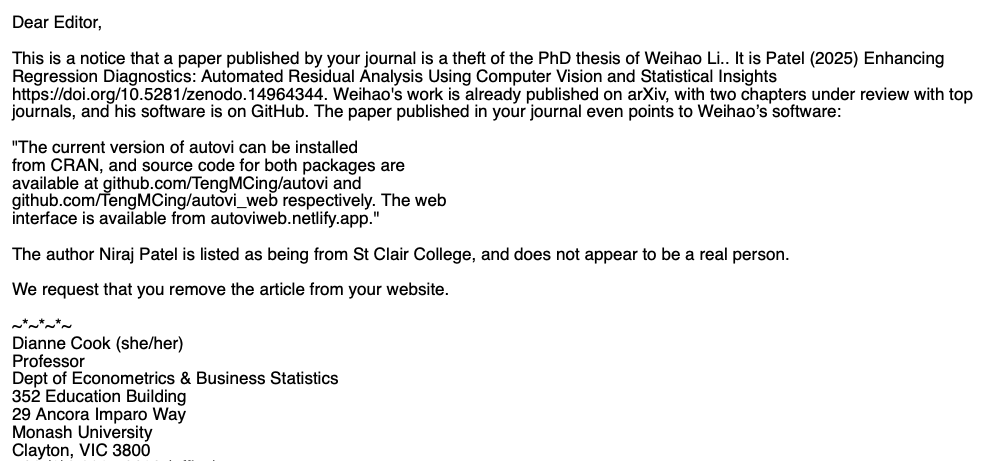{width=700 fig-align="center" style="box-shadow:0 8px 20px rgba(0,0,0,.25); border-radius:8px;"}

and Patrick sent this to the Business School Research office:

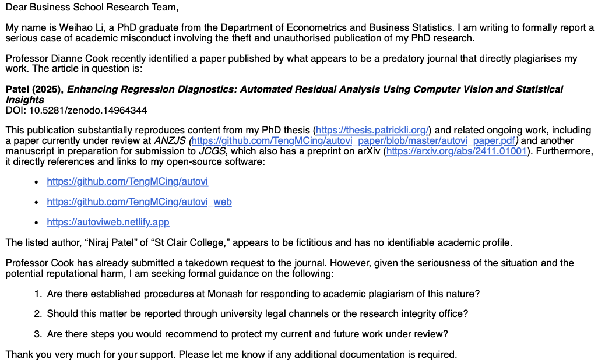{width=700 fig-align="center" style="box-shadow:0 8px 20px rgba(0,0,0,.25); border-radius:8px;"}

The editor responded quickly at 5:29pm Apr 25, a little over two hours from my initial email, with:

> *We have been informed to the author of this article. We are waiting for a reply from that side.*

Nothing more, so at 6:42pm on Apr 30, I emailed them again:

> *I see that the article is still available online. It needs to be taken down.*

The editor responds on May 3, 9:15pm with:

> *Hello Author, Can you send the Web-link of that. Thanks*

To which we responded with:

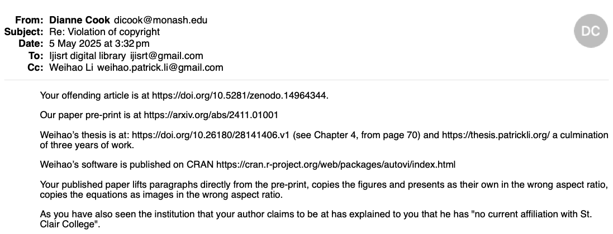{width=750 fig-align="center" style="box-shadow:0 8px 20px rgba(0,0,0,.25); border-radius:8px;"}

The email exchanges with the editor continued through April, with highlights being:

- a plagiarism report produced with Turnitin with text highlighted, and a 4% similarity score!!! (Supports my experience that Turnitin is rarely useful.)
- Neeraj begging him not to remove the article.
- the editor sending this email to me, and requesting that we jointly resolve the problem.

## Clair College moved quickly

On Apr 30, at 6:59pm, I also sent an email to three administrators at Clair College:

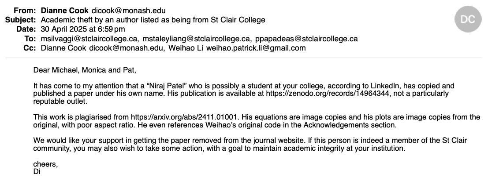{width=700 fig-align="center" style="box-shadow:0 8px 20px rgba(0,0,0,.25); border-radius:8px;"}

They responded within four hours:

> *Thank you, Dianne, for your email. We appreciate you bringing this to our attention, and we will investigate the matter immediately.*

Patrick also emailed them on May 4, with more details. On May 5, 1:05pm they responded that they had contacted the journal and requested the paper be removed.

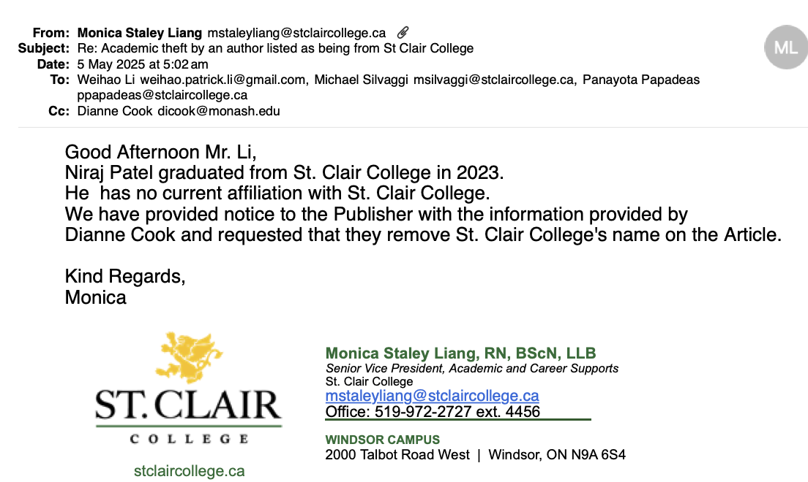{width=700 fig-align="center" style="box-shadow:0 8px 20px rgba(0,0,0,.25); border-radius:8px;"}

This generated an immediate response from the journal: St Clair was removed from the paper's website.

## Monash finally killed it

On May 14, I contacted our research office again:

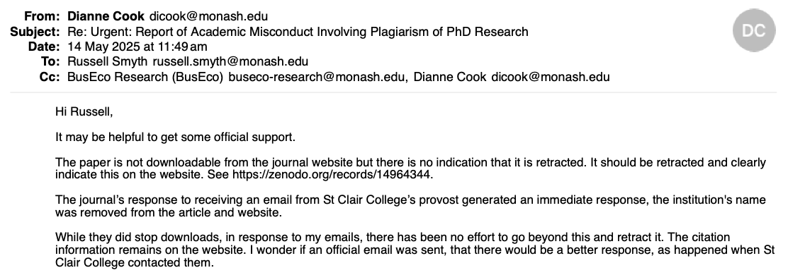{width=750 fig-align="center" style="box-shadow:0 8px 20px rgba(0,0,0,.25); border-radius:8px;"}

Our research office did follow up and contact the journal editor, and on May 22, at 11:59pm they reported:

> *Although I would have preferred them to list the real reason the article was taken down, I've at least got them to take it down. So the original article at 10.5281/zenodo.14964344 is no longer accessible.*

The article is still visible as a citation even though it can not be downloaded. IThe reason given is simply "Take-down request".

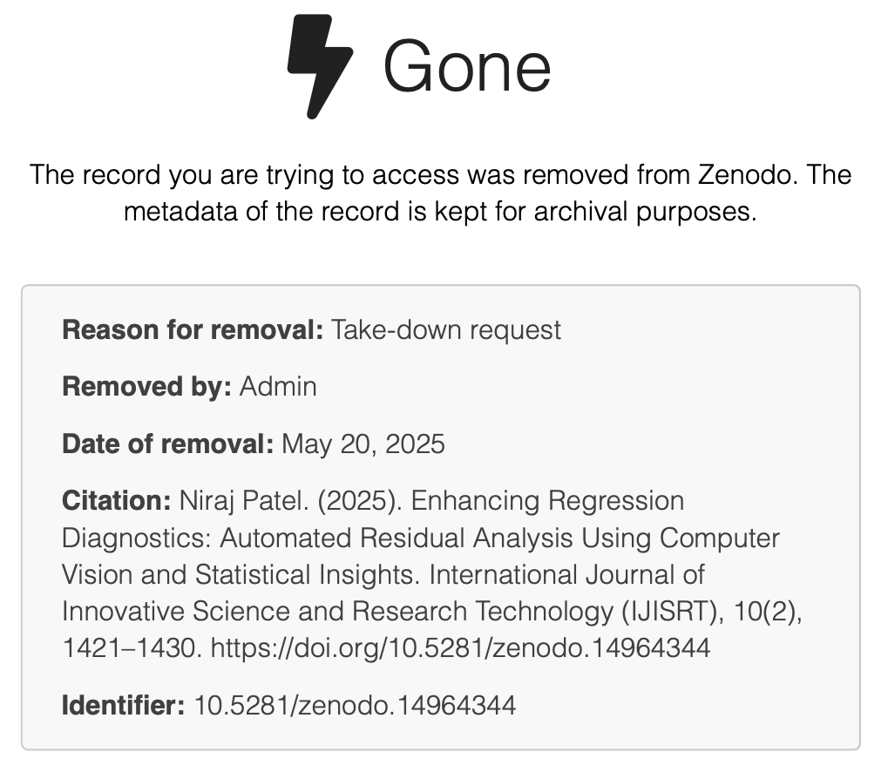{width=450 fig-align="center" style="box-shadow:0 8px 20px rgba(0,0,0,.25); border-radius:8px;"}

but I love that the web address is:

{width=250 fig-align="center" style="box-shadow:0 8px 20px rgba(0,0,0,.25); border-radius:8px;"}

## Lastly

One of Patrick's papers documenting the software has appeared in [ANZJS Special issue: 25 YeaRs](https://onlinelibrary.wiley.com/doi/toc/10.1111/%28ISSN%291467-842X.25-years) and the second paper that is closest to the plagiarised article is close to being accepted for the Journal of Computational and Graphical Statistics.

The process could have been a little easier. A lot of emails went back and forwards in various directions. This is likely to increasingly occur, so having some system to report academic dishonesty like this with a clear process to follow and a database of records would be helpful. 

Early on, our research office suggested that we should not post work until is is accepted for publication. For Statistics, this is unrealistic because it can take a long time for work to finally appear in print, on the order of 1-3 years! Our process of posting on arXiv when the work is submitted provides a more accurate timestamp for when the work was conducted, and from which to establish credit. And the practice of using version control for the projects, using GitHub helps support that this is our work, and documents the contribution of each author.

